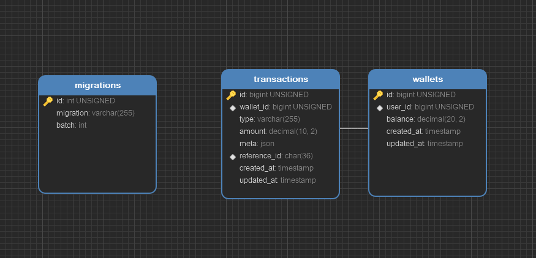

# Laravel Wallet service

## Introduction

This is a simple wallet service written in `php` and makes use of `laravel framework`.

### APIs

It contains two endpoints:

- /api/get-balance
- /api/add-money

#### /api/get-balance

With this endpoint, user can get his\her balance.

#### /api/add-money

With this endpoint, user can deposit or withdraw money from his\her wallet.

### Jobs

This project has a schedule job that calculate daily transaction in service and print it out in the terminal.

to run this job you can use artisan command like this:

```bash
docker-compose run --rm artisan schedule:work #on-docker

php artisan schedule:work #on-local
```

## API docs

you can use swagger or postman collection.

- postman: [postman_collection.json](./docs/postman/Roomvue challenge.postman_collection.json)
- swagger: `/docs`

## Installation

this project can be run with docker:

first, you MUST set all your environment variables in `.env` file. please create this file based on `.env.example`
file and fill all variables.

then, you can run this command (make sure docker and docker-compose are up and running on your machine):

```bash
docker-compose up --build -d

docker-compose run --rm composer install

docker-compose run --rm artisan migrate

docker-compose run --rm artisan schedule:work
```

or you can simply install packages and run project:

```bash
composer install

php artisan migrate

php artisan serve

php artisan schedule:work # in another thread
```

#### docs:

this folder contains postman documents for API collections. it also contains schema file of project database.

## Database schema



## Testing

To run tests, run this command in docker:

```bash
docker-compose run --rm artisan test
```

or if you want to run them in your local:

```bash
php artisan test
```

## Packages information

| Use case      | Package                                                   |
|---------------|-----------------------------------------------------------|
| Web framework | [`Laravel (^9.5.0)`](https://laravel.com/)                |
| Database      | [`mysql (8.0)`](https://www.mysql.com/)                   |

